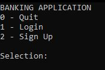

<h1>Banking Project V3</h1>

This is a class project I made using C++ and SQL programming languages in Spring 2024. Visual Studio 2022 and MySQL were used to build the program and the databases that contain the information that are used during runtime. This project simulates a Banking Application where customers can manage their money and add other members as contacts in order to request & send funds. The manager role can see who is enrolled, pull information, and delete invalid users.

## Main.cpp

  []

The program launches in a console window, which is best displayed in fullscreen for the most efficient experience. 
The user is presented with 3 options:
1. **Quit**

   Terminates the program
   
2. **Login**
   
   User can log into the system with their credentials

3. **Sign Up**

   User can choose this option to create an account in the system

## CreateAccount.h

  []

Account creation operations are a part of the CreateAccount class and also interacts with the Database class which contains access to the MySQL databases. When the user wants to create an account, they need to go through a sign up process and fill out information. First the user must enter their first and last names.
Next, they need to choose what account they are signing up for: 
- Customer
- Manager

Next, the user will need to enter an email and phone number that will be connected to their account. If the user is signing up for a customer account, then the program will generate a random bank account number for them. This will not happen for users signing up for a manager account. Finally, the user will come up with a username and secure password as their login credentials.

That is the end of the sign up process and then the program will write all the information and save it into the customer or manager database respectively. Now the user can log in!

## UserLogin.h

  []

Login operations are a part of the CreateAccount class and also interacts with the Database class which contains access to the MySQL databases. Customer and Manager classes are also involved in order to provide the correct functions based on the account type. First the user needs to enter what account type they are trying to log into (customer/manager). Next, the user needs to enter their username and password. The program will send this entered information into a function called <ins>**CheckUserType**</ins>. The Database class will then access the MySQL databases and search for the user infomation using queries that the entered information will help build and other predetermined queries. If the user is a customer, the program will search in the Customer database and if the user is a manager, then the program will search in the Manager database instead. The program will go row by row to find the matching login credentials and if a match is found, all of the important information of the row will be pushed onto a vector. The vector is then checked to see if it is empty or not empty. If it is empty, that means matching information was not found and therefore the login is invalid, the user must try again. Otherwise, the vector contains matching user information and the login attempt was successful.

The user will then be redirected to their respective dashboard according to their account type. All their available options are presented to them on the screen.

## Customer.h

  []

When the customer successfully logs into their account, they are greeted on the dashboard with their name and 
